# Kubernetes Cheat Sheet

## Introduction

This Kubernetes Cheat Sheet is a comprehensive reference designed for DevOps engineers, platform engineers, and developers working with Kubernetes. It covers Kubernetes concepts, architecture, and practical examples based on Kubernetes v1.26+.

This guide is structured to serve both as a learning resource and a quick reference. Beginners should start with the Core Concepts section, while experienced users can jump directly to specific sections as needed.

The guide includes diagrams, YAML examples, troubleshooting tips, and best practices to help you effectively work with Kubernetes in development and production environments.

## Table of Contents
- [Quick Reference Diagrams](#quick-reference-diagrams)
- [Common kubectl Commands](#common-kubectl-commands)
- [YAML Examples](#yaml-examples)
- [Kubernetes Core Concepts](#kubernetes-core-concepts)
- [Kubernetes Architecture](#kubernetes-architecture-1)
- [Advanced Workload Management](#advanced-workload-management)
- [Kubernetes Networking](#kubernetes-networking)
  - [Kubernetes Traffic Routing Flow](#kubernetes-traffic-routing-flow)
- [Storage Management](#storage-management)
- [Security](#security)
- [Advanced Scheduling](#advanced-scheduling)
- [Observability](#observability)
- [Advanced Topics](#advanced-topics)
- [Troubleshooting and Debugging](#troubleshooting-and-debugging)
- [Kubernetes in Production](#kubernetes-in-production)
- [Health Checks and Application Lifecycle](#health-checks-and-application-lifecycle)
- [Stateful Applications](#stateful-applications)
- [CI/CD and Deployment Strategies](#cicd-and-deployment-strategies)
- [Kubernetes Ecosystem](#kubernetes-ecosystem)
- [Cloud-Native Patterns](#cloud-native-patterns)
- [Cloud Provider Implementations](#cloud-provider-implementations)
- [Interview Preparation](#interview-preparation)
- [Certification Paths and Learning Resources](#certification-paths-and-learning-resources)
- [Kubernetes Glossary](#kubernetes-glossary)
- [Community Resources](#community-resources)
- [References](#references)

## Quick Reference Diagrams

### Kubernetes Components (Official)

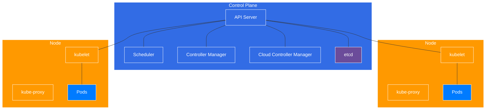

### Control Plane to Node Communication

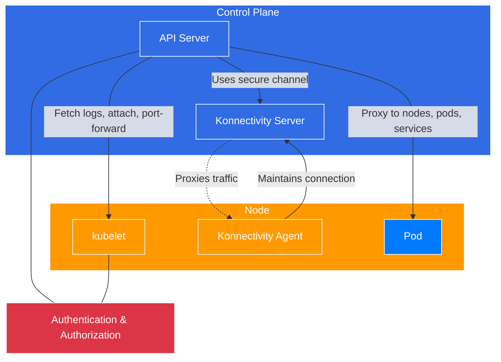

### Controller Pattern

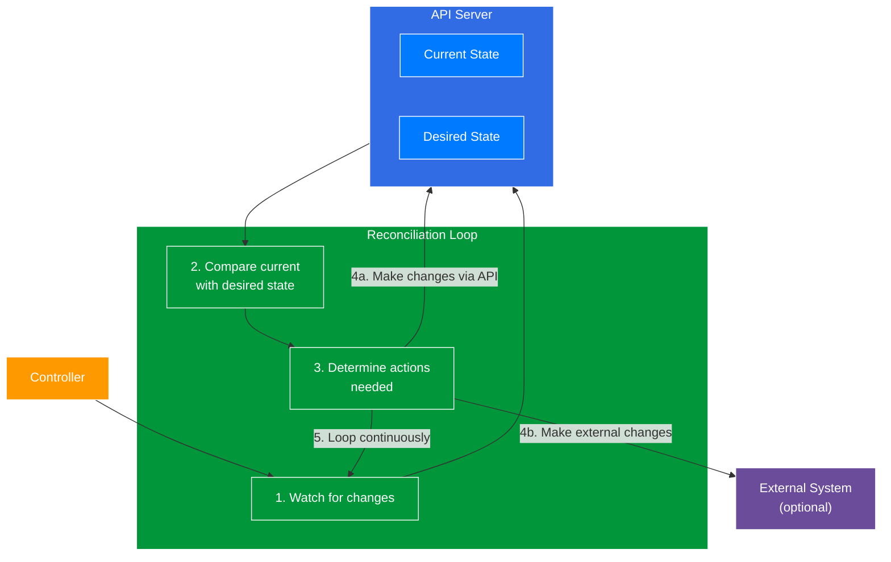

The Kubernetes Controller Pattern is a fundamental concept that drives the cluster's self-healing capabilities through a reconciliation loop:

1. **Watch**: Controllers continuously watch the API server for changes to resources they're responsible for
2. **Compare**: They compare the current state with the desired state stored in the API server
3. **Determine Actions**: Based on the differences, they determine what actions are needed
4. **Take Action**: They make changes either through the Kubernetes API or to external systems
5. **Loop Continuously**: This process runs as a non-terminating loop, ensuring the system maintains the desired state

This pattern is used throughout Kubernetes for resources like Deployments, ReplicaSets, StatefulSets, and custom resources.

This pattern is similar to a thermostat in a room - the controller observes the current temperature (current state), compares it to the desired temperature setting (desired state), and takes action (turning heating/cooling on or off) to reconcile the difference.

Examples of controllers in Kubernetes:
- **Deployment Controller**: Ensures the correct number of ReplicaSets exist
- **ReplicaSet Controller**: Ensures the correct number of Pods are running
- **Node Controller**: Monitors node health and responds when nodes become unavailable
- **Endpoint Controller**: Populates the Endpoints object for Services
- **Namespace Controller**: Cleans up resources when namespaces are deleted

### Controllers vs Operators

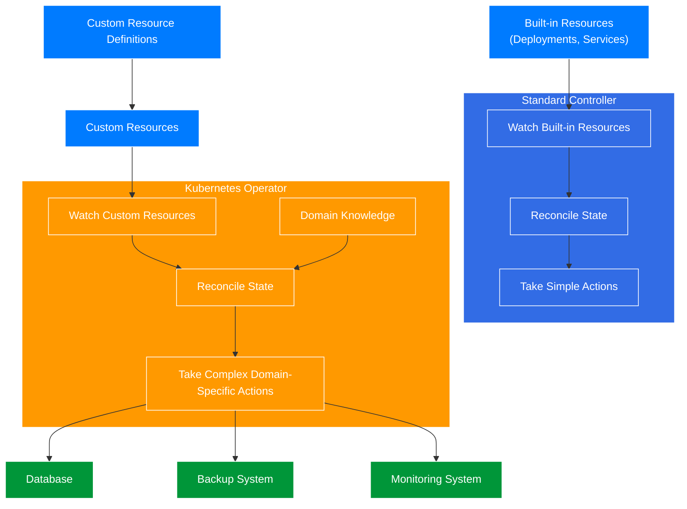

#### What is a Controller?
A controller is a core component in Kubernetes that manages the state of built-in resources. Controllers implement control loops that continuously monitor the cluster's state and make changes to move the current state towards the desired state.

#### What is an Operator?
An operator is an extension of the controller pattern that encodes domain-specific knowledge to automate the entire lifecycle of a complex application. Operators use Custom Resource Definitions (CRDs) to define application-specific resources and implement controllers that understand how to manage these custom resources.

#### Key Differences

| Aspect | Controller | Operator |
|--------|------------|----------|
| Resources Managed | Built-in Kubernetes resources | Custom resources defined by CRDs |
| Complexity | Manages simple reconciliation | Handles complex application lifecycle |
| Domain Knowledge | Generic Kubernetes concepts | Application-specific expertise |
| Examples | Deployment, ReplicaSet controllers | Prometheus, MongoDB, PostgreSQL operators |
| Development | Part of Kubernetes core | Custom development, often by app vendors |

#### Operator Capabilities Maturity Model

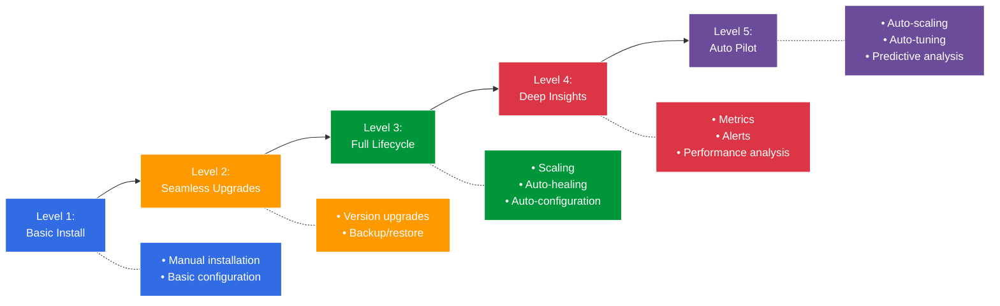

#### Popular Kubernetes Operators
- **Prometheus Operator**: Manages Prometheus monitoring instances
- **Elasticsearch Operator**: Manages Elasticsearch clusters
- **PostgreSQL Operator**: Automates PostgreSQL database provisioning and management
- **Istio Operator**: Manages service mesh deployments
- **Strimzi Operator**: Manages Apache Kafka clusters

#### Building Operators
Operators can be built using frameworks like:
- **Operator SDK**: Part of the Operator Framework, supports Go, Ansible, and Helm
- **KUDO (Kubernetes Universal Declarative Operator)**: Declarative approach to building operators
- **Kubebuilder**: SDK for building Kubernetes APIs using CRDs
- **Metacontroller**: Lightweight framework for writing custom controllers

### Kubernetes Architecture

#### Comprehensive Architecture Overview

```mermaid
flowchart TD
    %% External Components
    USER["User/Client"]
    REGISTRY["Container Registry"]
    CLOUD["Cloud Provider API"]

    %% Control Plane Components
    subgraph CONTROL_PLANE["Control Plane Node"]
        direction TB
        API["API Server<br>(Central Communication Hub)"]
        ETCD["etcd<br>(Cluster State Database)"]
        CM["Controller Manager<br>(State Management)"]
        CCM["Cloud Controller Manager<br>(Cloud Integration)"]
        SCHED["Scheduler<br>(Pod Placement)"]

        %% Control Plane Internal Connections
        API <--> ETCD
        API <--> CM
        API <--> CCM
        API <--> SCHED
    end

    %% Worker Node 1
    subgraph WORKER1["Worker Node 1"]
        direction TB
        KUBELET1["kubelet<br>(Node Agent)"]
        KPROXY1["kube-proxy<br>(Network Proxy)"]

        subgraph CRI1["Container Runtime"]
            CONTAINERD1["containerd/Docker/CRI-O"]
        end

        subgraph PODS1["Pods"]
            POD1A["Pod A"]
            POD1B["Pod B"]

            subgraph POD1A_DETAIL["Pod A Details"]
                CONTAINER1["Container 1"]
                CONTAINER2["Container 2"]
                VOLUME1["Volume"]
            end
        end

        %% Worker 1 Internal Connections
        KUBELET1 --> CRI1
        CRI1 --> PODS1
        KPROXY1 --> PODS1
    end

    %% Worker Node 2
    subgraph WORKER2["Worker Node 2"]
        direction TB
        KUBELET2["kubelet<br>(Node Agent)"]
        KPROXY2["kube-proxy<br>(Network Proxy)"]

        subgraph CRI2["Container Runtime"]
            CONTAINERD2["containerd/Docker/CRI-O"]
        end

        subgraph PODS2["Pods"]
            POD2A["Pod C"]
            POD2B["Pod D"]
        end

        %% Worker 2 Internal Connections
        KUBELET2 --> CRI2
        CRI2 --> PODS2
        KPROXY2 --> PODS2
    end

    %% Networking Components
    subgraph NETWORKING["Cluster Networking"]
        CNI["Container Network Interface<br>(Pod Networking)"]
        SERVICES["Services<br>(Load Balancing)"]
        INGRESS["Ingress<br>(External Access)"]
    end

    %% Storage Components
    subgraph STORAGE["Storage"]
        PV["PersistentVolumes"]
        SC["StorageClass"]
        CSI["Container Storage Interface"]
    end

    %% External Connections
    USER --> API
    USER --> INGRESS
    REGISTRY --> CRI1
    REGISTRY --> CRI2
    CLOUD --> CCM
    CCM --> CLOUD

    %% Control Plane to Node Connections
    API --> KUBELET1
    API --> KUBELET2
    API --> KPROXY1
    API --> KPROXY2

    %% Networking Connections
    CNI --> PODS1
    CNI --> PODS2
    SERVICES --> PODS1
    SERVICES --> PODS2
    INGRESS --> SERVICES

    %% Storage Connections
    PV --> PODS1
    PV --> PODS2
    SC --> PV
    CSI --> PV

    %% Styling
    classDef external fill:#999999,color:white,stroke:#fff,stroke-width:1px
    classDef controlPlane fill:#326ce5,color:white,stroke:#fff,stroke-width:1px
    classDef workerNode fill:#ff9900,color:white,stroke:#fff,stroke-width:1px
    classDef pods fill:#007bff,color:white,stroke:#fff,stroke-width:1px
    classDef container fill:#00b0f0,color:white,stroke:#fff,stroke-width:1px
    classDef storage fill:#6b4c9a,color:white,stroke:#fff,stroke-width:1px
    classDef networking fill:#dc3545,color:white,stroke:#fff,stroke-width:1px
    classDef runtime fill:#009639,color:white,stroke:#fff,stroke-width:1px

    class USER,REGISTRY,CLOUD external
    class CONTROL_PLANE,API,ETCD,CM,CCM,SCHED controlPlane
    class WORKER1,WORKER2,KUBELET1,KUBELET2,KPROXY1,KPROXY2 workerNode
    class PODS1,PODS2,POD1A,POD1B,POD2A,POD2B,POD1A_DETAIL pods
    class CONTAINER1,CONTAINER2 container
    class STORAGE,PV,SC,CSI,VOLUME1 storage
    class NETWORKING,CNI,SERVICES,INGRESS networking
    class CRI1,CRI2,CONTAINERD1,CONTAINERD2 runtime
```

#### Key Components Explained

**Control Plane Components:**
- **API Server**: Central management point that receives all REST requests for modifications to the cluster state
- **etcd**: Consistent and highly-available key-value store used as Kubernetes' backing store for all cluster data
- **Controller Manager**: Runs controller processes that regulate the state of the cluster
- **Cloud Controller Manager**: Integrates with underlying cloud provider APIs
- **Scheduler**: Watches for newly created Pods with no assigned node, and selects a node for them to run on

**Worker Node Components:**
- **kubelet**: Agent that runs on each node to ensure containers are running in a Pod
- **kube-proxy**: Network proxy that maintains network rules on nodes
- **Container Runtime**: Software responsible for running containers (Docker, containerd, CRI-O)
- **Pods**: Groups of one or more containers that share storage and network resources

**Networking:**
- **Container Network Interface (CNI)**: Provides networking for Pods
- **Services**: Stable endpoint to connect to a logical set of Pods
- **Ingress**: Manages external access to services in a cluster

**Storage:**
- **PersistentVolumes**: Storage resources provisioned by an administrator
- **StorageClass**: Describes the "classes" of storage offered
- **Container Storage Interface (CSI)**: Standard for exposing storage systems to containers

### Pod and Container Relationship

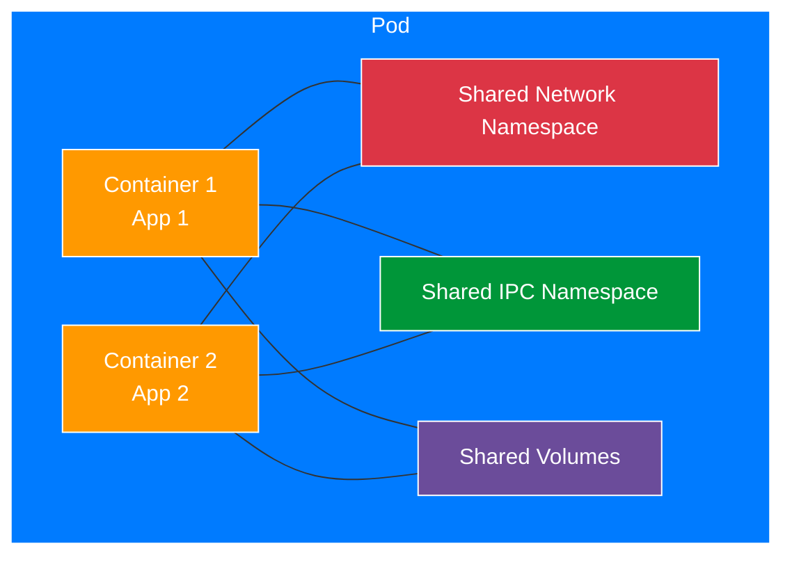

### Kubernetes Object Hierarchy and Relationships

```mermaid
flowchart TD
    %% Cluster-level Resources
    subgraph CLUSTER["Kubernetes Cluster"]
        NS["Namespace"]
        CRD["CustomResourceDefinition"]
        NODE["Node"]
        SC["StorageClass"]
        PV["PersistentVolume"]
        NETPOL["NetworkPolicy"]
        CLUSTERROLE["ClusterRole"]
        CLUSTERRB["ClusterRoleBinding"]
    end

    %% Namespace-level Resources
    subgraph NAMESPACE["Namespace Resources"]
        %% Workload Resources
        DEPLOY["Deployment"]
        STS["StatefulSet"]
        DS["DaemonSet"]
        JOB["Job"]
        CRONJOB["CronJob"]

        %% Configuration Resources
        CM["ConfigMap"]
        SECRET["Secret"]
        SA["ServiceAccount"]
        ROLE["Role"]
        RB["RoleBinding"]

        %% Storage Resources
        PVC["PersistentVolumeClaim"]

        %% Networking Resources
        SVC["Service"]
        ING["Ingress"]
        EP["Endpoints"]

        %% Controlled Resources
        RS["ReplicaSet"]
        POD["Pod"]
    end

    %% Pod Components
    subgraph POD_DETAIL["Pod Details"]
        INIT_C["Init Container"]
        APP_C["Application Container"]
        SIDECAR["Sidecar Container"]
        VOL["Volume"]
    end

    %% Hierarchical Relationships
    CLUSTER --> NS

    %% Workload Controllers
    DEPLOY --> RS
    RS --> POD
    STS --> POD
    DS --> POD
    JOB --> POD
    CRONJOB --> JOB

    %% Pod Components
    POD --> INIT_C
    POD --> APP_C
    POD --> SIDECAR
    POD --> VOL

    %% Configuration
    POD --> CM
    POD --> SECRET
    POD --> SA

    %% Storage
    SC --> PV
    PV --> PVC
    PVC --> VOL

    %% Networking
    SVC --> EP
    EP -.-> POD
    ING --> SVC
    NETPOL -.-> POD

    %% RBAC
    SA --> RB
    ROLE --> RB
    CLUSTERROLE --> CLUSTERRB
    CLUSTERROLE --> RB

    %% Node Scheduling
    NODE --> POD

    %% Styling
    classDef cluster fill:#326ce5,color:white,stroke:#fff,stroke-width:1px
    classDef workload fill:#ff9900,color:white,stroke:#fff,stroke-width:1px
    classDef config fill:#009639,color:white,stroke:#fff,stroke-width:1px
    classDef storage fill:#6b4c9a,color:white,stroke:#fff,stroke-width:1px
    classDef networking fill:#dc3545,color:white,stroke:#fff,stroke-width:1px
    classDef pod fill:#007bff,color:white,stroke:#fff,stroke-width:1px

    class NS,CRD,NODE,CLUSTERROLE,CLUSTERRB cluster
    class DEPLOY,STS,DS,JOB,CRONJOB,RS workload
    class CM,SECRET,SA,ROLE,RB config
    class SC,PV,PVC,VOL storage
    class SVC,ING,EP,NETPOL networking
    class POD,INIT_C,APP_C,SIDECAR pod
```

### Kubernetes Object Relationships Explained

Kubernetes objects form a hierarchical relationship that defines how applications are deployed and managed:

#### Cluster-Level Resources
- **Nodes**: Physical or virtual machines that run your workloads
- **Namespaces**: Virtual clusters that provide isolation for resources
- **PersistentVolumes**: Storage resources provisioned by administrators
- **StorageClasses**: Define different classes of storage
- **ClusterRoles/ClusterRoleBindings**: Cluster-wide RBAC permissions

#### Workload Resources
- **Deployments**: Manage ReplicaSets and provide declarative updates
- **StatefulSets**: Manage stateful applications with stable identities
- **DaemonSets**: Ensure specific Pods run on all (or some) Nodes
- **Jobs/CronJobs**: Run tasks to completion on a schedule
- **ReplicaSets**: Maintain a stable set of replica Pods

#### Configuration Resources
- **ConfigMaps**: Store non-confidential configuration data
- **Secrets**: Store sensitive information like passwords and tokens
- **ServiceAccounts**: Provide identities for processes running in Pods

#### Networking Resources
- **Services**: Expose Pods as network services
- **Ingress**: Manage external access to Services
- **NetworkPolicies**: Define how Pods communicate with each other

#### Storage Resources
- **PersistentVolumeClaims**: Request storage resources
- **Volumes**: Mount storage into Pods

This hierarchy ensures that Kubernetes can manage complex applications while maintaining separation of concerns between different resource types.

### Service Types

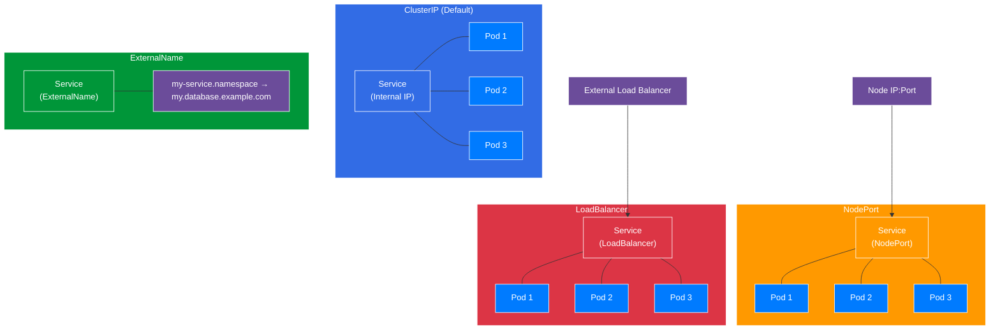

### Service Types Explained

| Service Type | Description | Use Case | Port Range | Accessibility |
|--------------|-------------|----------|------------|---------------|
| **ClusterIP** | Default type that exposes the service on an internal IP within the cluster | Internal communication between services | Any | Only within cluster |
| **NodePort** | Exposes the service on each node's IP at a static port | Development, testing, or when external load balancer isn't available | 30000-32767 | External via node IP |
| **LoadBalancer** | Exposes service externally using cloud provider's load balancer | Production workloads requiring external access | Any | External via load balancer IP |
| **ExternalName** | Maps service to DNS name, returns CNAME record | Connecting to external services | N/A | Within cluster via DNS |

#### Key Characteristics

- **ClusterIP**:
  - Internal-only IP address
  - Stable endpoint for pod-to-pod communication
  - Default service type

- **NodePort**:
  - Builds on ClusterIP
  - Opens specific port on all nodes
  - Traffic to NodePort is routed to service

- **LoadBalancer**:
  - Builds on NodePort
  - Provisions external load balancer
  - Requires cloud provider integration

- **ExternalName**:
  - No proxying, just DNS CNAME
  - Useful for integrating with external systems
  - No selectors, ports, or endpoints

### Common kubectl Commands

```
# Cluster Info
kubectl cluster-info
kubectl get nodes
kubectl get namespaces

# Resource Management
kubectl get pods [-n namespace]
kubectl get services [-n namespace]
kubectl get deployments [-n namespace]
kubectl describe pod <pod-name>
kubectl logs <pod-name> [-c container-name]
kubectl exec -it <pod-name> -- /bin/sh

# Resource Creation
kubectl apply -f <file.yaml>
kubectl create namespace <name>
kubectl run <pod-name> --image=<image>
kubectl expose deployment <name> --port=<port>

# Scaling
kubectl scale deployment <name> --replicas=<count>
kubectl autoscale deployment <name> --min=2 --max=5 --cpu-percent=80

# Updates and Rollbacks
kubectl set image deployment/<name> <container>=<image>:<tag>
kubectl rollout status deployment/<name>
kubectl rollout history deployment/<name>
kubectl rollout undo deployment/<name> [--to-revision=<rev>]

# Cleanup
kubectl delete -f <file.yaml>
kubectl delete pod <pod-name>
kubectl delete namespace <name>
```

### YAML Examples

#### Pod
```yaml
apiVersion: v1
kind: Pod
metadata:
  name: nginx-pod
  labels:
    app: nginx
spec:
  containers:
  - name: nginx
    image: nginx:1.19
    ports:
    - containerPort: 80
    resources:
      requests:
        memory: "64Mi"
        cpu: "250m"
      limits:
        memory: "128Mi"
        cpu: "500m"
```

#### Deployment
```yaml
apiVersion: apps/v1
kind: Deployment
metadata:
  name: nginx-deployment
  labels:
    app: nginx
spec:
  replicas: 3
  selector:
    matchLabels:
      app: nginx
  template:
    metadata:
      labels:
        app: nginx
    spec:
      containers:
      - name: nginx
        image: nginx:1.19
        ports:
        - containerPort: 80
```

#### Service
```yaml
apiVersion: v1
kind: Service
metadata:
  name: nginx-service
spec:
  selector:
    app: nginx
  ports:
  - port: 80
    targetPort: 80
  type: ClusterIP  # or NodePort, LoadBalancer
```

#### ConfigMap
```yaml
apiVersion: v1
kind: ConfigMap
metadata:
  name: app-config
data:
  config.json: |
    {
      "environment": "production",
      "debug": false
    }
  settings.properties: |
    app.name=MyApp
    app.version=1.0.0
```

#### Secret
```yaml
apiVersion: v1
kind: Secret
metadata:
  name: app-secrets
type: Opaque
data:
  username: YWRtaW4=  # base64 encoded "admin"
  password: cGFzc3dvcmQxMjM=  # base64 encoded "password123"
```

#### Persistent Volume Claim
```yaml
apiVersion: v1
kind: PersistentVolumeClaim
metadata:
  name: data-pvc
spec:
  accessModes:
    - ReadWriteOnce
  resources:
    requests:
      storage: 1Gi
  storageClassName: standard
```

#### StatefulSet with Persistent Storage
```yaml
apiVersion: apps/v1
kind: StatefulSet
metadata:
  name: postgres
spec:
  serviceName: "postgres"
  replicas: 3
  selector:
    matchLabels:
      app: postgres
  template:
    metadata:
      labels:
        app: postgres
    spec:
      containers:
      - name: postgres
        image: postgres:13
        ports:
        - containerPort: 5432
          name: postgres
        env:
        - name: POSTGRES_PASSWORD
          valueFrom:
            secretKeyRef:
              name: postgres-secrets
              key: password
        volumeMounts:
        - name: data
          mountPath: /var/lib/postgresql/data
  volumeClaimTemplates:
  - metadata:
      name: data
    spec:
      accessModes: [ "ReadWriteOnce" ]
      storageClassName: "standard"
      resources:
        requests:
          storage: 10Gi
```

#### Horizontal Pod Autoscaler
```yaml
apiVersion: autoscaling/v2
kind: HorizontalPodAutoscaler
metadata:
  name: api-hpa
spec:
  scaleTargetRef:
    apiVersion: apps/v1
    kind: Deployment
    name: api-deployment
  minReplicas: 2
  maxReplicas: 10
  metrics:
  - type: Resource
    resource:
      name: cpu
      target:
        type: Utilization
        averageUtilization: 80
  - type: Resource
    resource:
      name: memory
      target:
        type: Utilization
        averageUtilization: 80
```

#### Ingress with TLS and Path-based Routing
```yaml
apiVersion: networking.k8s.io/v1
kind: Ingress
metadata:
  name: app-ingress
  annotations:
    nginx.ingress.kubernetes.io/rewrite-target: /
spec:
  tls:
  - hosts:
    - myapp.example.com
    secretName: myapp-tls-secret
  rules:
  - host: myapp.example.com
    http:
      paths:
      - path: /api
        pathType: Prefix
        backend:
          service:
            name: api-service
            port:
              number: 80
      - path: /
        pathType: Prefix
        backend:
          service:
            name: frontend-service
            port:
              number: 80
```

#### Network Policy for Pod Isolation
```yaml
apiVersion: networking.k8s.io/v1
kind: NetworkPolicy
metadata:
  name: api-network-policy
  namespace: production
spec:
  podSelector:
    matchLabels:
      app: api
  policyTypes:
  - Ingress
  - Egress
  ingress:
  - from:
    - podSelector:
        matchLabels:
          app: frontend
    ports:
    - protocol: TCP
      port: 8080
  egress:
  - to:
    - podSelector:
        matchLabels:
          app: database
    ports:
    - protocol: TCP
      port: 5432
```

#### CronJob for Scheduled Tasks
```yaml
apiVersion: batch/v1
kind: CronJob
metadata:
  name: backup-job
spec:
  schedule: "0 2 * * *"  # Run at 2:00 AM every day
  concurrencyPolicy: Forbid
  successfulJobsHistoryLimit: 3
  failedJobsHistoryLimit: 1
  jobTemplate:
    spec:
      template:
        spec:
          containers:
          - name: backup
            image: backup-image:latest
            command: ["/bin/sh", "-c", "echo Starting backup; date; backup.sh; echo Backup complete"]
            volumeMounts:
            - name: backup-config
              mountPath: /etc/backup
          volumes:
          - name: backup-config
            configMap:
              name: backup-config
          restartPolicy: OnFailure
```

#### Multi-container Pod with Sidecar
```yaml
apiVersion: v1
kind: Pod
metadata:
  name: app-with-sidecar
spec:
  containers:
  - name: app
    image: main-app:latest
    ports:
    - containerPort: 8080
    volumeMounts:
    - name: logs
      mountPath: /var/log/app
  - name: log-collector
    image: log-collector:latest
    volumeMounts:
    - name: logs
      mountPath: /var/log/app
      readOnly: true
  volumes:
  - name: logs
    emptyDir: {}
```

## Kubernetes Core Concepts

### API Request Flow

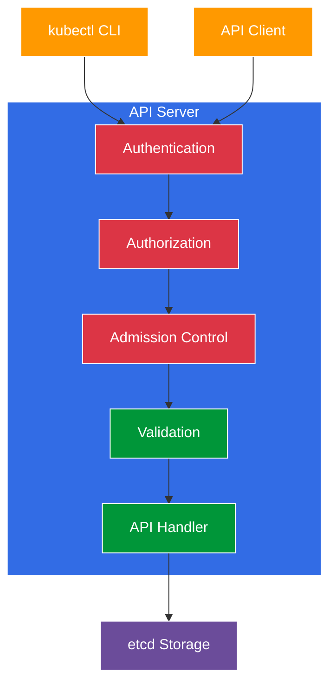

### Pods
- **Definition**: Smallest deployable unit in Kubernetes
- **Characteristics**:
  - Contains one or more containers
  - Shares network namespace, storage, and lifecycle
  - Has a unique IP address within the cluster
- **Lifecycle**: Pending → Running → Succeeded/Failed → Unknown
- **Common Use**: Application containers, init containers, sidecar containers

### Services
- **Purpose**: Provides stable networking for pods
- **Types**:
  - ClusterIP: Internal-only IP (default)
  - NodePort: Exposes on static port on each node
  - LoadBalancer: Exposes externally using cloud provider's load balancer
  - ExternalName: Maps to DNS name
- **Service Discovery**: Via DNS or environment variables

### Volumes
- **Purpose**: Provides persistent storage for pods
- **Types**:
  - emptyDir: Temporary storage tied to pod lifecycle
  - hostPath: Mounts from the host node's filesystem
  - PersistentVolume (PV): Cluster-wide storage resource
  - PersistentVolumeClaim (PVC): Request for storage by a user

## Kubernetes Architecture

### Comprehensive Architecture Overview

```mermaid
flowchart TD
    %% External User Access
    USER["User/Client"]
    KUBECTL["kubectl CLI"]
    CLIENT_LIB["Client Libraries"]

    %% Control Plane Components
    subgraph CONTROL_PLANE["Control Plane"]
        API["kube-apiserver"]
        ETCD["etcd"]
        SCHED["kube-scheduler"]
        CM["kube-controller-manager"]
        CCM["cloud-controller-manager"]
    end

    %% Worker Nodes
    subgraph WORKER_NODES["Worker Nodes"]
        subgraph NODE1["Node 1"]
            KUBELET1["kubelet"]
            KPROXY1["kube-proxy"]
            CRI1["Container Runtime"]
            subgraph PODS1["Pods"]
                POD1_1["Pod 1"]
                POD1_2["Pod 2"]
            end
        end

        subgraph NODE2["Node 2"]
            KUBELET2["kubelet"]
            KPROXY2["kube-proxy"]
            CRI2["Container Runtime"]
            subgraph PODS2["Pods"]
                POD2_1["Pod 1"]
                POD2_2["Pod 2"]
            end
        end
    end

    %% Add-ons
    subgraph ADDONS["Cluster Add-ons"]
        DNS["CoreDNS"]
        DASHBOARD["Dashboard"]
        METRICS["Metrics Server"]
    end

    %% External Systems
    CLOUD["Cloud Provider API"]
    REGISTRY["Container Registry"]
    STORAGE["Storage Provider"]
    LB["Load Balancer"]

    %% User Access Connections
    USER --> KUBECTL
    USER --> CLIENT_LIB
    KUBECTL --> API
    CLIENT_LIB --> API

    %% Control Plane Connections
    API <--> ETCD
    API <--> SCHED
    API <--> CM
    API <--> CCM
    CCM <--> CLOUD

    %% Node Connections
    API <--> KUBELET1
    API <--> KUBELET2
    API <--> KPROXY1
    API <--> KPROXY2

    %% Pod Management
    KUBELET1 --> CRI1
    KUBELET2 --> CRI2
    CRI1 --> POD1_1
    CRI1 --> POD1_2
    CRI2 --> POD2_1
    CRI2 --> POD2_2

    %% Add-ons Connections
    API <--> DNS
    API <--> DASHBOARD
    API <--> METRICS

    %% External Connections
    CRI1 <--> REGISTRY
    CRI2 <--> REGISTRY
    API <--> STORAGE
    KPROXY1 <--> LB
    KPROXY2 <--> LB

    %% Styling
    classDef controlPlane fill:#326ce5,color:white,stroke:#fff,stroke-width:1px
    classDef node fill:#f9f9f9,stroke:#999,stroke-width:1px
    classDef pod fill:#d4e5ff,stroke:#326ce5,stroke-width:1px
    classDef external fill:#f5f5f5,stroke:#666,stroke-width:1px

    class API,ETCD,SCHED,CM,CCM controlPlane
    class NODE1,NODE2,KUBELET1,KUBELET2,KPROXY1,KPROXY2,CRI1,CRI2 node
    class PODS1,PODS2,POD1_1,POD1_2,POD2_1,POD2_2 pod
    class CLOUD,REGISTRY,STORAGE,LB external
```

### Control Plane Components

The Control Plane is the brain of Kubernetes that manages the entire cluster:

- **kube-apiserver**: The front-end of the Kubernetes control plane that exposes the Kubernetes API
- **etcd**: Consistent and highly-available key-value store used as Kubernetes' backing store for all cluster data
- **kube-scheduler**: Watches for newly created Pods with no assigned node, and selects a node for them to run on
- **kube-controller-manager**: Runs controller processes that regulate the state of the cluster
- **cloud-controller-manager**: Embeds cloud-specific control logic and connects the cluster to the cloud provider's API

### Node Components

Worker Nodes are the machines that run containerized applications:

- **kubelet**: An agent that runs on each node to ensure containers are running in a Pod
- **kube-proxy**: Maintains network rules on nodes to allow network communication to Pods
- **Container Runtime**: Software responsible for running containers (Docker, containerd, CRI-O)

### Cluster Add-ons

Essential services that extend Kubernetes functionality:

- **CoreDNS**: Provides DNS services within the cluster
- **Dashboard**: Web-based UI for cluster management
- **Metrics Server**: Collects resource metrics from Kubelets

### Control Plane Components
- **API Server**: Front-end for Kubernetes control plane
- **etcd**: Consistent and highly-available key-value store
- **Scheduler**: Assigns pods to nodes
- **Controller Manager**: Runs controller processes
- **Cloud Controller Manager**: Integrates with cloud provider APIs

### Node Components
- **kubelet**: Ensures containers are running in a pod
- **kube-proxy**: Maintains network rules on nodes
- **Container Runtime**: Software for running containers (Docker, containerd)

## Advanced Workload Management

### DaemonSets
- **Purpose**: Ensures all nodes run a copy of a pod
- **Use Cases**: Monitoring agents, log collectors, node-level features
- **Behavior**: Automatically deploys to new nodes when added to cluster
- **Key Features**:
  - Can target specific nodes using nodeSelector or affinity
  - Can respect taints and tolerations
  - Pods are garbage collected when nodes are removed

### StatefulSets
- **Purpose**: Manages stateful applications with stable identities
- **Use Cases**: Databases, distributed systems (Kafka, Elasticsearch, etc.)
- **Key Features**:
  - Stable, unique network identifiers (pod-0, pod-1, etc.)
  - Stable, persistent storage that survives pod rescheduling
  - Ordered, graceful deployment and scaling operations
  - Predictable pod naming pattern (app-0, app-1, app-2)
  - Headless service for direct pod addressing
- **Limitations**:
  - Storage must be provisioned by PersistentVolume or dynamic provisioner
  - Deletion/scaling down doesn't delete associated volumes for data safety

### Jobs and CronJobs
- **Jobs**: Run-to-completion workloads
- **CronJobs**: Time-based jobs (like cron in Linux)
- **Parameters**: backoffLimit, activeDeadlineSeconds, parallelism

### ConfigMaps and Secrets
- **ConfigMaps**: Store non-confidential configuration data
- **Secrets**: Store sensitive information (base64 encoded)
- **Usage**: Environment variables, volume mounts, command-line arguments

## Kubernetes Networking

### Cluster Networking Model
- **Pod-to-Pod Communication**: Flat network where all pods can communicate
- **Node-to-Pod Communication**: Via CNI (Container Network Interface)
- **Pod-to-Service Communication**: Via kube-proxy (iptables/IPVS)
- **External-to-Service Communication**: Via NodePort, LoadBalancer, Ingress

### Ingress Controllers
- **Purpose**: HTTP/HTTPS routing to services
- **Features**: Path-based routing, TLS termination, name-based virtual hosting
- **Popular Implementations**: Nginx, Traefik, HAProxy, AWS ALB

### Network Policies
- **Purpose**: Pod-level firewall rules
- **Selectors**: podSelector, namespaceSelector
- **Policy Types**: Ingress, Egress
- **Default Behavior**: Allow all traffic if no policies exist

## Storage Management

### Storage Classes
- **Purpose**: Defines different classes of storage
- **Provisioners**: Links to storage backend (AWS EBS, GCE PD, etc.)
- **Parameters**: Type, IOPS, encryption, etc.

### Volume Snapshots
- **Purpose**: Point-in-time copies of volumes
- **Usage**: Backups, creating new volumes from snapshots
- **API Objects**: VolumeSnapshot, VolumeSnapshotContent, VolumeSnapshotClass

## Security

### Authentication
- **Methods**: X.509 certificates, service accounts, OIDC, webhook tokens
- **User Types**: Service accounts (managed by Kubernetes), normal users (external)
- **Best Practices**:
  - Use short-lived certificates
  - Implement certificate rotation
  - Use external identity providers (OIDC)

### Authorization
- **RBAC**: Role-Based Access Control
  - Roles/ClusterRoles: Sets of permissions
  - RoleBindings/ClusterRoleBindings: Assign roles to users/groups
- **Other Modes**: Node, ABAC, Webhook
- **Best Practices**:
  - Follow principle of least privilege
  - Use namespaces for isolation
  - Regularly audit RBAC permissions

### Pod Security
- **Pod Security Standards**: Baseline, Restricted, Privileged
- **Security Context**: User/group IDs, capabilities, SELinux context
- **Pod Security Admission**: Enforces security standards at namespace level
- **Best Practices**:
  - Run containers as non-root
  - Use read-only root filesystems
  - Drop unnecessary Linux capabilities

### Network Security
- **Network Policies**: Pod-level firewall rules
- **Service Mesh**: mTLS between services
- **API Server Access**: Restrict to private networks
- **Best Practices**:
  - Default-deny network policies
  - Encrypt pod-to-pod traffic
  - Implement egress filtering

### Supply Chain Security
- **Image Scanning**: Vulnerability scanning (Trivy, Clair)
- **Image Signing**: Content trust (Notary, Cosign)
- **Admission Control**: Enforce policies on images (OPA, Kyverno)
- **Best Practices**:
  - Use minimal base images
  - Pin image versions with digests
  - Implement CI/CD security gates

### Secrets Management
- **Kubernetes Secrets**: Base64 encoded (not encrypted at rest by default)
- **External Solutions**: HashiCorp Vault, AWS Secrets Manager, Azure Key Vault
- **CSI Secrets Driver**: Mount external secrets as files
- **Best Practices**:
  - Enable etcd encryption
  - Use external secrets management
  - Implement secret rotation

## Advanced Scheduling

### Affinity and Anti-Affinity
- **Node Affinity**: Schedule pods on specific nodes based on labels
- **Pod Affinity**: Co-locate pods with other pods
- **Pod Anti-Affinity**: Avoid co-locating pods with other pods

### Taints and Tolerations
- **Taints**: Applied to nodes to repel pods
- **Tolerations**: Applied to pods to schedule on tainted nodes
- **Effects**: NoSchedule, PreferNoSchedule, NoExecute

### Resource Management
- **Requests**: Minimum resources guaranteed
- **Limits**: Maximum resources allowed
- **QoS Classes**: Guaranteed, Burstable, BestEffort
- **LimitRanges**: Default resource limits for namespace
- **ResourceQuotas**: Limit aggregate resource consumption per namespace

## Observability

### Logging
- **Container Logs**: stdout/stderr captured by container runtime
- **Node-Level Logging**: Agents like Fluentd, Filebeat
- **Cluster-Level Solutions**: ELK Stack, Loki, Stackdriver

### Monitoring
- **Metrics**: CPU, memory, network, custom metrics
- **Tools**: Prometheus, Grafana, Datadog
- **Kubernetes Metrics Server**: Basic resource metrics

### Tracing
- **Distributed Tracing**: Track requests across services
- **Tools**: Jaeger, Zipkin, OpenTelemetry

## Advanced Topics

### Custom Resource Definitions (CRDs)
- **Purpose**: Extend Kubernetes API
- **Components**: CRD definition, custom controller
- **Validation**: OpenAPI schema validation
- **Versioning**: Multiple versions with conversion webhooks

### Operators
- **Purpose**: Automate application management
- **Components**: CRDs + controllers
- **Operator Framework**: SDK, Lifecycle Manager, Metering
- **Examples**: Prometheus, Elasticsearch, PostgreSQL operators

### Service Mesh
- **Purpose**: Network infrastructure layer for microservices
- **Features**: Traffic management, security, observability
- **Implementations**: Istio, Linkerd, Consul

### GitOps
- **Concept**: Git as single source of truth for declarative infrastructure
- **Tools**: Flux, ArgoCD, Jenkins X
- **Benefits**: Versioning, audit trail, automated reconciliation

## Troubleshooting and Debugging

### Troubleshooting Flowchart

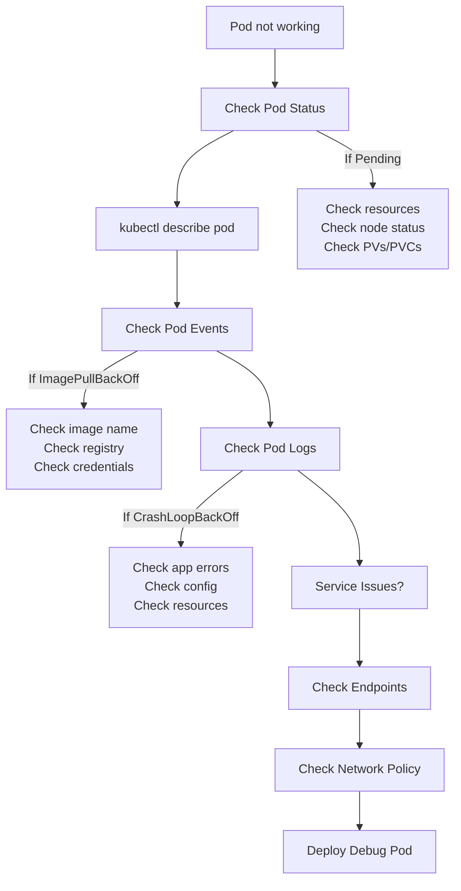

### Kubernetes Networking Architecture

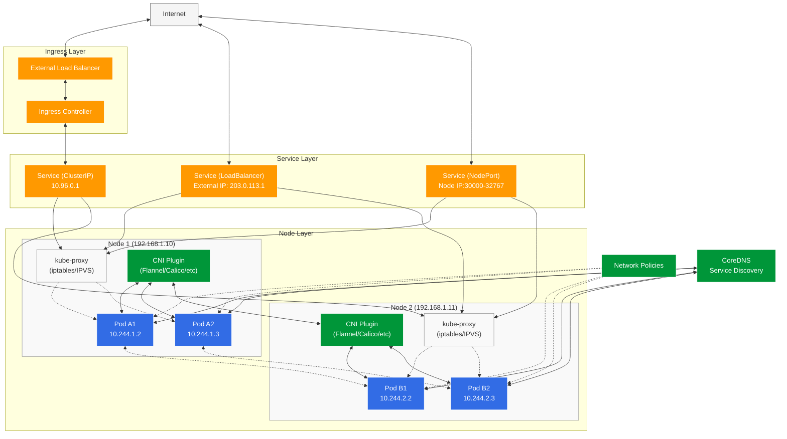

### Kubernetes Networking Explained

Kubernetes networking follows four fundamental requirements:

1. **Containers within a Pod** share a network namespace and can communicate via localhost
2. **Pod-to-Pod communication** occurs across nodes without NAT
3. **Pods have unique IP addresses** that are consistent across the cluster
4. **Services abstract** Pod IPs and provide stable endpoints

#### Network Components:

- **Container Network Interface (CNI)**: Plugins like Calico, Flannel, or Cilium that implement the Kubernetes networking model
- **kube-proxy**: Creates virtual IP addresses for Services and handles traffic routing
- **CoreDNS**: Provides DNS-based service discovery within the cluster
- **Network Policies**: Kubernetes firewall rules that control traffic flow between Pods

#### Service Types:

- **ClusterIP**: Internal-only IP accessible within the cluster
- **NodePort**: Exposes the Service on each Node's IP at a static port
- **LoadBalancer**: Exposes the Service externally using a cloud provider's load balancer
- **ExternalName**: Maps a Service to a DNS name

### Kubernetes Traffic Routing Flow

#### Key Concept
Even if many Pods listen on the same port (e.g., port 80), Kubernetes routes traffic based on Pod IP addresses. Port 80 can be reused across Pods because each Pod has a unique network namespace and IP address.

#### Standard Kubernetes Routing Flow

```
Client (Browser/API Request) → Ingress Controller → Service (ClusterIP) → Pods (unique IPs)
```

Here's the detailed flow:

1. Client sends request to Ingress (port 80/443)
2. Ingress routes by host/path to appropriate Service (e.g., ClusterIP 10.96.0.5:80)
3. Service load balances to backend Pods:
   - Pod A (10.244.0.12:80)
   - Pod B (10.244.0.23:80)
   - Pod C (10.244.0.47:80)
4. Each Pod has its own IP address but can use the same port (80)

#### Key Benefits of This Architecture

1. **Scalability**: Add more Pods listening on the same port without conflicts
2. **Flexibility**: Replace Pods without changing the Service endpoint
3. **Load Balancing**: Distribute traffic across multiple Pod replicas
4. **Service Discovery**: Clients only need to know the Service name, not individual Pods

#### Cilium-Enhanced Routing Flow (with eBPF)

```
Client → Ingress → Service → Cilium eBPF → Pods
```

With Cilium, the key difference is:

1. Client sends request to Ingress (port 80/443)
2. Ingress routes by host/path to appropriate Service
3. **Cilium eBPF intercepts the traffic** (bypassing kube-proxy)
4. Cilium load balances directly to Pods:
   - Pod A (10.244.0.12:80)
   - Pod B (10.244.0.23:80)
   - Pod C (10.244.0.47:80)
5. eBPF programs in the Linux kernel handle the routing for higher performance

#### What Changes with Cilium

* **No iptables/IPVS** → Cilium uses eBPF programs attached to the Linux kernel.
* Cilium intercepts traffic before kube-proxy would.
* Faster routing, lower latency, better observability (via Hubble).

**Result**:
```
Client → Ingress → Service → Cilium eBPF → Pod
```

Pod IPs and port 80 are still used for routing, but the data plane is now eBPF, not iptables.

#### Routing Components Summary

| Component | Purpose |
|-----------|---------|
| **Pods** | Each gets a unique IP; can all use port 80 without conflict |
| **Service** | Creates a stable virtual IP and load balances to Pods |
| **Ingress** | Provides HTTP/HTTPS routing based on hostnames and paths |
| **kube-proxy (default)** | Uses iptables or IPVS for routing |
| **Cilium (eBPF)** | Replaces kube-proxy, handles routing/load balancing at the kernel level |

**Why this works**: Kubernetes separates IP space (unique per Pod) from port numbers (which can repeat). With Cilium, this gets even faster and smarter thanks to eBPF.

### Common Issues
- **Pod Failures**: CrashLoopBackOff, ImagePullBackOff, Error, Pending
- **Networking Issues**: Service connectivity, DNS resolution, network policies
- **Resource Constraints**: OOMKilled, CPU throttling, evictions
- **Control Plane Issues**: API server unavailability, etcd problems

### Debugging Tools
- **kubectl**: describe, logs, exec, port-forward, debug
- **Kubernetes Dashboard**: Visual interface for cluster resources
- **kube-state-metrics**: Cluster-level metrics
- **Kube-Prometheus**: Monitoring stack with Prometheus and Grafana

### Debugging Strategies
- **Pod Troubleshooting**:
  - Check pod status and events: `kubectl describe pod <pod-name>`
  - Examine logs: `kubectl logs <pod-name> [-c <container-name>]`
  - Access container shell: `kubectl exec -it <pod-name> -- /bin/sh`
- **Service Troubleshooting**:
  - Verify endpoints: `kubectl get endpoints <service-name>`
  - Test DNS resolution: `nslookup <service-name>.<namespace>.svc.cluster.local`
  - Check service connectivity: Deploy debug pod in same namespace
- **Node Troubleshooting**:
  - Check node status: `kubectl describe node <node-name>`
  - Review node logs: `journalctl` on the node
  - Verify kubelet status: `systemctl status kubelet`

### Observability Stack
- **Logging Pipeline**: Fluentd/Fluent Bit → Elasticsearch → Kibana
- **Metrics Pipeline**: Prometheus → Grafana
- **Tracing Pipeline**: Jaeger/Zipkin with OpenTelemetry instrumentation
- **Alerts and Notifications**: AlertManager, PagerDuty integration

### Common Troubleshooting Scenarios

#### Scenario 1: Pod Stuck in Pending State
```
Problem: Pod remains in Pending state and won't start
```

**Diagnosis Steps**:
1. Check for resource constraints:
   ```bash
   kubectl describe pod <pod-name>
   ```
   Look for events indicating insufficient CPU, memory, or GPU resources

2. Check if PersistentVolumeClaim is bound:
   ```bash
   kubectl get pvc
   ```
   If PVC is pending, check storage class and available storage

3. Check node taints and pod tolerations:
   ```bash
   kubectl get nodes -o custom-columns=NAME:.metadata.name,TAINTS:.spec.taints
   ```
   Ensure pod has appropriate tolerations for node taints

**Common Solutions**:
- Adjust resource requests to match available resources
- Add more nodes to the cluster
- Modify pod tolerations to match node taints
- Check storage provisioner is working correctly

#### Scenario 2: Pod in CrashLoopBackOff
```
Problem: Pod starts but keeps crashing and restarting
```

**Diagnosis Steps**:
1. Check pod logs:
   ```bash
   kubectl logs <pod-name> --previous
   ```
   Look for application errors or exceptions

2. Check container exit code:
   ```bash
   kubectl describe pod <pod-name>
   ```
   Look for "Exit Code" in the container status section
   - Exit Code 1: Application error
   - Exit Code 137: OOM killed
   - Exit Code 143: SIGTERM (graceful termination)

3. Check if liveness probe is failing:
   ```bash
   kubectl describe pod <pod-name>
   ```
   Look for failed liveness probe events

**Common Solutions**:
- Fix application bugs causing crashes
- Adjust memory limits if pod is being OOM killed
- Adjust liveness probe parameters if too strict
- Check for proper initialization in container entrypoint

#### Scenario 3: Service Not Routing Traffic to Pods
```
Problem: Service exists but doesn't route traffic to pods
```

**Diagnosis Steps**:
1. Verify service and endpoints:
   ```bash
   kubectl get endpoints <service-name>
   ```
   If no endpoints, service selector may not match pod labels

2. Check pod labels:
   ```bash
   kubectl get pods --show-labels
   ```
   Ensure pods have labels matching service selector

3. Test connectivity directly to pod:
   ```bash
   kubectl run -it --rm debug --image=busybox -- wget -O- <pod-ip>:<port>
   ```
   If direct connection works, issue is with service

4. Check kube-proxy logs:
   ```bash
   kubectl logs -n kube-system -l k8s-app=kube-proxy
   ```
   Look for errors in proxy configuration

**Common Solutions**:
- Correct service selector to match pod labels
- Ensure pods are in Ready state
- Verify pods are listening on the correct port
- Restart kube-proxy if iptables rules are corrupted

#### Scenario 4: Persistent Volume Issues
```
Problem: PersistentVolumeClaim remains pending or volume mount fails
```

**Diagnosis Steps**:
1. Check PVC status:
   ```bash
   kubectl describe pvc <pvc-name>
   ```
   Look for events indicating provisioning issues

2. Check storage class:
   ```bash
   kubectl get storageclass
   ```
   Ensure storage class exists and is default if not specified

3. Check storage provisioner:
   ```bash
   kubectl get pods -n kube-system | grep provisioner
   ```
   Ensure storage provisioner pods are running

4. Check volume mount events in pod:
   ```bash
   kubectl describe pod <pod-name>
   ```
   Look for volume mount errors in events

**Common Solutions**:
- Create storage class if missing
- Check cloud provider permissions for volume provisioning
- Ensure CSI drivers are installed and running
- Check for capacity issues in storage backend

## Kubernetes in Production

### High Availability
- **Control Plane HA**: Multiple API servers, etcd clusters
- **Worker Node HA**: Multiple nodes across zones
- **Application HA**: Pod disruption budgets, topology spread constraints

### Disaster Recovery
- **etcd Backups**: Regular snapshots
- **Resource Backups**: Tools like Velero
- **Recovery Strategies**: Full cluster, selective resources

### Upgrade Strategies
- **Control Plane Upgrades**: One component at a time
- **Worker Node Upgrades**: Rolling updates, surge upgrades
- **Application Upgrades**: Rolling updates, blue/green, canary

### Multi-Cluster Management
- **Federation**: Cross-cluster resource management
- **Fleet Management**: Tools like Rancher, Google Anthos, Azure Arc
- **Service Mesh Federation**: Cross-cluster service discovery and routing

## Health Checks and Application Lifecycle

### Probes
- **Liveness Probe**: Determines if a container is running properly
  - Failure triggers container restart
  - Types: HTTP GET, TCP Socket, Exec command
- **Readiness Probe**: Determines if a container can receive traffic
  - Failure removes pod from service endpoints
  - Prevents traffic to pods that aren't ready
- **Startup Probe**: Determines when an application has started
  - Disables liveness and readiness checks until successful
  - Useful for slow-starting applications

### Lifecycle Hooks
- **PostStart**: Executes immediately after container creation
- **PreStop**: Executes before container termination
- **Use Cases**: Cleanup, notifications, graceful shutdown

## Stateful Applications

### StatefulSets
- **Purpose**: Manages stateful applications
- **Features**:
  - Stable, unique network identifiers
  - Stable, persistent storage
  - Ordered, graceful deployment and scaling
- **Use Cases**: Databases, distributed systems (Kafka, Elasticsearch)

### Headless Services
- **Purpose**: Direct access to specific pods
- **Implementation**: Service with `clusterIP: None`
- **DNS**: Each pod gets a DNS entry (`pod-name.service-name.namespace.svc.cluster.local`)

### Persistent Storage Patterns
- **Local Storage**: High performance, node-bound
- **Remote Storage**: Network-attached, more flexible
- **Storage Orchestration**: Dynamic provisioning, snapshots, cloning

## CI/CD and Deployment Strategies

### Kubernetes Deployment Workflow

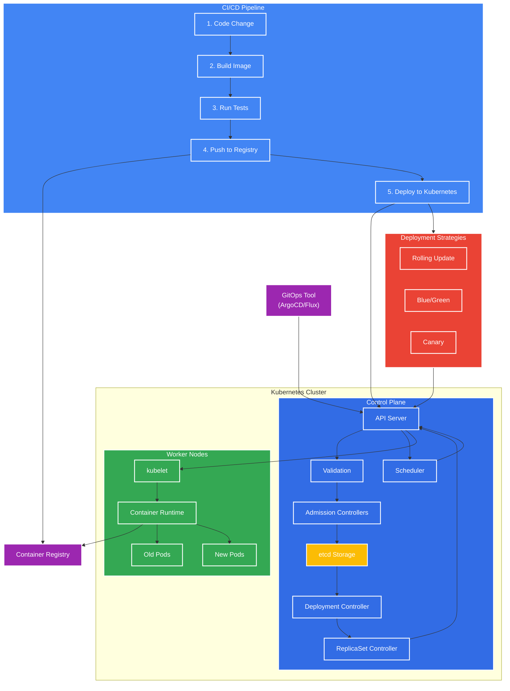

### Deployment Strategies

#### Rolling Update (Default)
- **How it works**: Gradually replaces old Pods with new ones
- **Benefits**: Zero downtime, controlled rollout
- **Configuration**:
  ```yaml
  spec:
    strategy:
      type: RollingUpdate
      rollingUpdate:
        maxUnavailable: 25%
        maxSurge: 25%
  ```
- **Best for**: Most applications that can handle multiple versions running simultaneously

#### Blue/Green Deployment
- **How it works**: Deploys new version alongside old, then switches traffic
- **Benefits**: Instant rollback, no version mixing
- **Implementation**:
  - Create new Deployment with new version
  - Update Service selector to point to new Deployment
- **Best for**: Applications requiring atomic updates with no mixed versions

#### Canary Deployment
- **How it works**: Routes a small percentage of traffic to new version
- **Benefits**: Limited risk, gradual validation
- **Implementation**:
  - Deploy small number of new version Pods
  - Use Service Mesh or multiple Services with weighted routing
- **Best for**: High-risk changes, validating performance in production

#### A/B Testing
- **How it works**: Routes traffic based on specific criteria (headers, cookies)
- **Benefits**: Feature testing with specific user segments
- **Implementation**:
  - Use Ingress with canary annotations or Service Mesh
  - Configure routing rules based on request attributes
- **Best for**: Feature validation, user experience testing

### CI/CD Integration

#### GitOps Workflow
- **Principle**: Git repository as single source of truth
- **Tools**: ArgoCD, Flux CD
- **Benefits**: Declarative configuration, audit trail, automated sync

#### Pipeline Integration
- **CI Systems**: Jenkins, GitHub Actions, GitLab CI, CircleCI
- **Workflow**:
  1. Build container image
  2. Run tests
  3. Push to registry
  4. Update manifests
  5. Apply to cluster

#### Deployment Tools
- **Helm**: Package manager with templating
- **Kustomize**: Template-free customization
- **ArgoCD/Flux**: GitOps controllers
- **Spinnaker**: Advanced deployment orchestration

### Progressive Delivery
- **Feature Flags**: Toggle features without deployment
- **Traffic Splitting**: Percentage-based routing
- **Automated Rollbacks**: Based on metrics and SLOs

## Kubernetes Ecosystem

### Extending Kubernetes with Operators

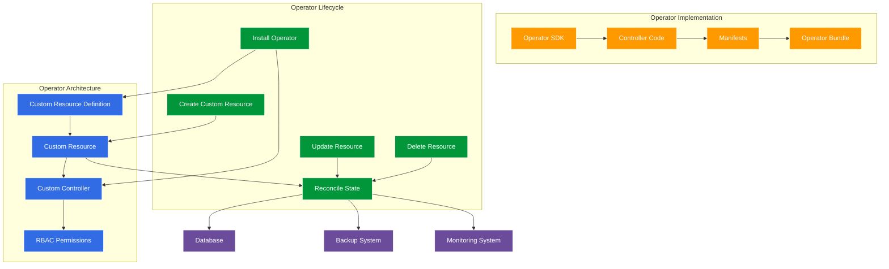

#### Operator Implementation Example: PostgreSQL Operator

```yaml
# 1. Custom Resource Definition (CRD)
apiVersion: apiextensions.k8s.io/v1
kind: CustomResourceDefinition
metadata:
  name: postgresclusters.postgres-operator.example.com
spec:
  group: postgres-operator.example.com
  names:
    kind: PostgresCluster
    plural: postgresclusters
    singular: postgrescluster
    shortNames:
      - pgcluster
  scope: Namespaced
  versions:
    - name: v1
      served: true
      storage: true
      schema:
        openAPIV3Schema:
          type: object
          properties:
            spec:
              type: object
              properties:
                version:
                  type: string
                replicas:
                  type: integer
                  minimum: 1
                storage:
                  type: object
                  properties:
                    size:
                      type: string
                backup:
                  type: object
                  properties:
                    enabled:
                      type: boolean
                    schedule:
                      type: string

# 2. Custom Resource (CR) Instance
apiVersion: postgres-operator.example.com/v1
kind: PostgresCluster
metadata:
  name: production-db
spec:
  version: "14.5"
  replicas: 3
  storage:
    size: 10Gi
  backup:
    enabled: true
    schedule: "0 0 * * *"
```

#### Operator Development Workflow

1. **Define the API**: Create Custom Resource Definitions (CRDs)
2. **Implement the Controller**: Write code that reconciles the desired state
3. **Package the Operator**: Bundle the CRDs, controller, and RBAC permissions
4. **Deploy the Operator**: Install in the cluster
5. **Create Custom Resources**: Users create instances of your custom resources
6. **Observe and Maintain**: Monitor the operator's behavior and update as needed

#### Real-World Operator Use Cases

- **Database Operators**: PostgreSQL, MySQL, MongoDB, Redis
  - Automated provisioning, backups, scaling, failover
  - Example: [Zalando Postgres Operator](https://github.com/zalando/postgres-operator)

- **Monitoring Operators**: Prometheus, Grafana
  - Deployment and configuration of monitoring stacks
  - Example: [Prometheus Operator](https://github.com/prometheus-operator/prometheus-operator)

- **Service Mesh Operators**: Istio, Linkerd
  - Simplified installation and management of service mesh components
  - Example: [Istio Operator](https://istio.io/latest/docs/setup/install/operator/)

- **Storage Operators**: Rook, Portworx
  - Management of storage resources and services
  - Example: [Rook Operator](https://rook.io/)

### Package Management
- **Helm**: De facto package manager
  - Charts, repositories, values, templates
  - Helm hooks, tests, and plugins
- **Kustomize**: Template-free customization
  - Overlays, patches, ConfigMap/Secret generation

### Policy Enforcement
- **Open Policy Agent (OPA)**: General-purpose policy engine
- **Kyverno**: Kubernetes-native policy management
- **Admission Controllers**: ValidatingWebhookConfiguration, MutatingWebhookConfiguration

### Developer Tools
- **Skaffold**: Local development workflow
- **Telepresence**: Local development with remote cluster
- **Kind/Minikube/K3s**: Local Kubernetes environments

## Cloud-Native Patterns

### Sidecar Pattern
- **Purpose**: Extend and enhance main container
- **Examples**: Logging agents, proxies, security scanners
- **Implementation**: Multi-container pods

### Ambassador Pattern
- **Purpose**: Proxy communication to outside world
- **Examples**: API gateways, protocol translators
- **Benefits**: Simplifies main application code

### Adapter Pattern
- **Purpose**: Standardize output from main container
- **Examples**: Monitoring adapters, log formatters
- **Benefits**: Consistent interfaces across applications

## Interview Preparation

### Common Interview Questions
1. Explain the difference between a pod and a container
2. How does service discovery work in Kubernetes?
3. Explain the Kubernetes networking model
4. How would you handle secrets in Kubernetes?
5. Describe the difference between a liveness probe and a readiness probe
6. How would you design a highly available Kubernetes cluster?
7. Explain how you would troubleshoot a pod that won't start
8. How would you implement CI/CD with Kubernetes?
9. Describe your experience with Kubernetes operators
10. How would you handle Kubernetes upgrades in production?
11. What are the differences between StatefulSets and Deployments?
12. How would you implement auto-scaling in Kubernetes?
13. Explain how you would secure a Kubernetes cluster
14. How do you manage configuration across environments?
15. Describe your experience with service mesh technologies

### Practical Exercises
1. Debug a failing pod
2. Set up a multi-tier application with proper networking
3. Implement RBAC for a new service account
4. Create a custom resource definition
5. Design a disaster recovery plan for a Kubernetes cluster
6. Implement a canary deployment strategy
7. Set up a StatefulSet with persistent storage
8. Configure horizontal pod autoscaling with custom metrics
9. Create a Helm chart for an application
10. Implement network policies for pod isolation

### Performance Optimization
- **Resource Tuning**: Right-sizing containers, HPA configuration
- **Cluster Scaling**: Cluster Autoscaler, Node pools
- **Cost Optimization**: Spot instances, resource quotas, namespace budgets
- **Efficiency Patterns**: Pod priority classes, vertical pod autoscaling
- **Workload Placement**: Node selectors, taints/tolerations, topology spread

## Certification Paths and Learning Resources

### Kubernetes Certifications
- **Certified Kubernetes Administrator (CKA)**
  - Focus: Cluster installation, configuration, management
  - Format: Performance-based exam (hands-on)
  - Duration: 2 hours
  - Passing Score: 66%

- **Certified Kubernetes Application Developer (CKAD)**
  - Focus: Designing, building, and deploying cloud-native applications
  - Format: Performance-based exam (hands-on)
  - Duration: 2 hours
  - Passing Score: 66%

- **Certified Kubernetes Security Specialist (CKS)**
  - Focus: Securing container-based applications and Kubernetes platforms
  - Format: Performance-based exam (hands-on)
  - Duration: 2 hours
  - Passing Score: 67%
  - Prerequisite: Valid CKA certification

### Learning Resources
- **Official Documentation**
  - [Kubernetes Docs](https://kubernetes.io/docs/home/)
  - [Kubernetes GitHub](https://github.com/kubernetes/kubernetes)

- **Interactive Learning**
  - [Katacoda](https://www.katacoda.com/courses/kubernetes)
  - [Play with Kubernetes](https://labs.play-with-k8s.com/)
  - [Kubernetes Playground](https://www.katacoda.com/courses/kubernetes/playground)

- **Books**
  - "Kubernetes: Up and Running" by Brendan Burns, Joe Beda, and Kelsey Hightower
  - "Kubernetes in Action" by Marko Lukša
  - "Kubernetes Patterns" by Bilgin Ibryam and Roland Huß

- **Courses**
  - Linux Foundation: Kubernetes Fundamentals (LFS258)
  - Linux Foundation: Kubernetes for Developers (LFD259)
  - Udemy: Certified Kubernetes Administrator (CKA) with Practice Tests

- **Practice Environments**
  - [KodeKloud](https://kodekloud.com/)
  - [Killer.sh](https://killer.sh/) (CKA/CKAD/CKS simulator)
  - [Kubernetes the Hard Way](https://github.com/kelseyhightower/kubernetes-the-hard-way)

### Community Resources
- **Slack**: Kubernetes Slack (kubernetes.slack.com)
- **Forums**: Kubernetes Forum, Stack Overflow
- **Meetups**: CNCF Meetups, Kubernetes Meetups
- **Conferences**: KubeCon + CloudNativeCon

## Cloud Provider Implementations

### Amazon Elastic Kubernetes Service (EKS)
- **Key Features**:
  - Managed control plane
  - Fargate for serverless container deployment
  - Integration with AWS services (IAM, VPC, ELB)
  - Managed node groups
- **Networking**:
  - Amazon VPC CNI plugin
  - AWS Load Balancer Controller for ALB/NLB integration
  - AWS Transit Gateway for multi-cluster networking
- **Storage Options**:
  - EBS CSI driver for persistent volumes
  - EFS CSI driver for ReadWriteMany volumes
  - FSx for Lustre for high-performance workloads
- **Security**:
  - IAM roles for service accounts (IRSA)
  - AWS KMS for secret encryption
  - Security groups for pod-level security
- **CLI Tools**:
  - eksctl - EKS CLI tool
  - AWS CLI with EKS commands

### Google Kubernetes Engine (GKE)
- **Key Features**:
  - Autopilot mode for fully managed Kubernetes
  - Release channels (Rapid, Regular, Stable)
  - Multi-cluster management with Fleet
  - GKE Enterprise for advanced features
- **Networking**:
  - Cloud NAT for outbound connectivity
  - Google Cloud Armor for WAF protection
  - Network Service Tiers for cost optimization
  - Service mesh with Cloud Service Mesh (Istio-based)
- **Storage Options**:
  - Persistent Disk CSI driver
  - Filestore CSI driver for ReadWriteMany volumes
  - Cloud Storage FUSE for object storage
- **Security**:
  - Workload Identity for GCP service authentication
  - Binary Authorization for image validation
  - Shielded GKE Nodes for secure boot
  - VPC Service Controls for network isolation
- **CLI Tools**:
  - gcloud container clusters commands
  - Google Cloud Console

### Microsoft Azure Kubernetes Service (AKS)
- **Key Features**:
  - Managed control plane (free)
  - Virtual node pools with Azure Container Instances
  - Azure Arc for hybrid/multi-cloud management
  - Cluster autoscaler and horizontal pod autoscaler
- **Networking**:
  - Azure CNI or kubenet networking
  - Application Gateway Ingress Controller
  - Azure Firewall for network security
  - Azure Front Door for global load balancing
- **Storage Options**:
  - Azure Disk CSI driver
  - Azure File CSI driver for ReadWriteMany volumes
  - Azure Blob CSI driver for object storage
- **Security**:
  - Azure Active Directory pod-managed identities
  - Azure Policy for Kubernetes
  - Azure Key Vault integration
  - Private AKS clusters
- **CLI Tools**:
  - az aks commands
  - Azure Portal

### Comparison Table

| Feature | EKS | GKE | AKS |
|---------|-----|-----|-----|
| Control Plane Cost | Charged | Charged | Free |
| Serverless Option | Fargate | Autopilot | Virtual Nodes |
| Identity Management | IAM Roles for Service Accounts | Workload Identity | Pod-managed Identities |
| Default CNI | Amazon VPC CNI | Calico | Azure CNI/kubenet |
| Managed Node Updates | Yes | Yes | Yes |
| Private Clusters | Yes | Yes | Yes |
| Multi-region Support | Yes | Yes | Yes |
| Integrated CI/CD | CodePipeline | Cloud Build | Azure DevOps |
| Integrated Registry | ECR | GCR/Artifact Registry | ACR |

## Interview Questions and Answers

### Basic Kubernetes Interview Questions

1. **What is Kubernetes?**
   - Kubernetes is an open-source platform designed to automate deploying, scaling, and operating application containers
   - Originally developed by Google, it has become the standard for managing containerized workloads and services
   - Provides a framework for orchestrating containers across a cluster of machines

2. **Explain Kubernetes Architecture**
   - **Control Plane Components**:
     - API Server: Front-end for Kubernetes control plane
     - etcd: Consistent and highly-available key-value store
     - Scheduler: Assigns pods to nodes
     - Controller Manager: Runs controller processes
   - **Worker Node Components**:
     - Kubelet: Ensures containers are running in a pod
     - Kube-proxy: Maintains network rules
     - Container Runtime: Software for running containers

3. **What is a Pod in Kubernetes?**
   - Smallest deployable unit in Kubernetes
   - Group of one or more containers with shared storage and network resources
   - Containers in a pod share the same IP address and port space
   - Pods are ephemeral - they don't survive failures or rescheduling

4. **How does Kubernetes handle container scaling?**
   - Uses Horizontal Pod Autoscaler (HPA) to automatically scale workloads
   - HPA adjusts the number of pods based on observed metrics (CPU, memory, custom metrics)
   - Scaling can be manual (kubectl scale) or automatic (HPA)
   - Vertical Pod Autoscaler (VPA) can adjust resource requests/limits

5. **What is Kubelet?**
   - Agent that runs on each node in the cluster
   - Ensures containers are running in a pod
   - Takes PodSpecs from the API server and ensures containers described are running and healthy
   - Reports node and pod status to the API server

### Intermediate Kubernetes Interview Questions

6. **Explain the concept of Ingress in Kubernetes**
   - API object that manages external access to services in a cluster
   - Provides HTTP/HTTPS routing, SSL termination, and name-based virtual hosting
   - Requires an Ingress Controller to function (e.g., NGINX, Traefik)
   - Simplifies external access configuration compared to multiple LoadBalancer services

7. **What is a ConfigMap?**
   - API object for storing non-confidential configuration data
   - Decouples configuration from application code
   - Can be consumed as environment variables, command-line arguments, or configuration files
   - Changes to ConfigMaps can be updated in running applications

8. **Describe the role of etcd in Kubernetes**
   - Distributed key-value store used as Kubernetes' primary datastore
   - Stores all cluster data including configuration, state, and metadata
   - Provides reliable watch functionality for changes to stored data
   - Supports strong consistency and high availability

9. **How do rolling updates work in a Deployment?**
   - Gradually replaces old pods with new ones
   - Ensures zero downtime during updates
   - Controls update rate with parameters like maxSurge and maxUnavailable
   - Automatically rolls back if deployment fails health checks

10. **What is a Namespace in Kubernetes?**
    - Virtual cluster within a physical cluster
    - Provides scope for names and allows resource isolation
    - Helps organize resources in multi-tenant environments
    - Default namespaces: default, kube-system, kube-public, kube-node-lease

### Advanced Kubernetes Interview Questions

11. **What is the role of the kube-scheduler in Kubernetes?**
    - Control plane component responsible for assigning pods to nodes
    - Considers resource requirements, constraints, and affinity/anti-affinity rules
    - Uses a two-step process: filtering and scoring
    - Can be customized with scheduling policies and profiles

12. **Describe how a Horizontal Pod Autoscaler (HPA) works**
    - Observes resource metrics of pods (CPU, memory, custom metrics)
    - Compares metrics to target values specified in HPA definition
    - Calculates desired replica count based on current metrics
    - Adjusts replica count of target resource (Deployment, StatefulSet, etc.)

13. **Explain the concept of Custom Resources in Kubernetes**
    - Extensions of the Kubernetes API
    - Allow defining custom objects beyond built-in resources
    - Used with Custom Controllers to implement domain-specific functionality
    - Foundation for Kubernetes Operators

14. **How does Kubernetes handle security and access control?**
    - Uses Role-Based Access Control (RBAC) for authorization
    - Supports multiple authentication methods
    - Network Policies control pod-to-pod communication
    - Pod Security Policies/Standards define security contexts for pods
    - Secrets manage sensitive information

15. **What is a Network Policy in Kubernetes?**
    - Specification of how groups of pods are allowed to communicate
    - Provides pod-level network segmentation and isolation
    - Controls ingress and egress traffic based on labels, namespaces, and CIDRs
    - Requires a network plugin that supports Network Policies

### Kubernetes Interview Questions for Experienced Professionals

16. **Explain the concept of a Custom Operator in Kubernetes**
    - Pattern for extending Kubernetes with domain-specific knowledge
    - Combines Custom Resources with custom controllers
    - Automates complex application lifecycle management
    - Follows the "Kubernetes way" of declarative configuration

17. **Describe the internals of the Kubernetes control plane**
    - API Server: RESTful API for all operations, authentication, authorization
    - Controller Manager: Runs controller processes (Node, Replication, Endpoints)
    - Scheduler: Assigns pods to nodes based on constraints and resources
    - etcd: Distributed key-value store for all cluster data
    - Cloud Controller Manager: Integrates with cloud provider APIs

18. **How does Kubernetes handle node failures and resiliency?**
    - Node controller detects node failures and marks nodes as unhealthy
    - Pod eviction process removes pods from failed nodes
    - Replication controllers/Deployments ensure desired pod count is maintained
    - Pod disruption budgets protect critical applications during voluntary disruptions
    - Cluster autoscaler can add new nodes to replace failed ones

19. **Explain how to set up and use Role-Based Access Control (RBAC) in Kubernetes**
    - Define Roles/ClusterRoles that specify permissions
    - Create RoleBindings/ClusterRoleBindings to assign roles to users/groups
    - Use service accounts for in-cluster processes
    - Follow principle of least privilege
    - Regularly audit RBAC configurations

20. **What is Helm in Kubernetes?**
    - Package manager for Kubernetes
    - Uses "charts" to define, install, and upgrade applications
    - Provides templating for Kubernetes manifests
    - Supports versioning and rollbacks
    - Manages dependencies between applications

## Kubernetes Glossary

This glossary provides definitions for common Kubernetes terminology to help you understand the concepts and components discussed in this guide.

| Term | Definition |
|------|------------|
| **API Server** | The front-end of the Kubernetes control plane that exposes the Kubernetes API and serves as the gateway for all cluster operations. |
| **Cluster** | A set of worker nodes and control plane nodes that run containerized applications managed by Kubernetes. |
| **ConfigMap** | An API object used to store non-confidential configuration data in key-value pairs. |
| **Container** | A lightweight, standalone, executable software package that includes everything needed to run an application. |
| **Container Runtime** | The software responsible for running containers (e.g., containerd, CRI-O, Docker). |
| **Control Plane** | The container orchestration layer that exposes the API and interfaces to define, deploy, and manage the lifecycle of containers. |
| **Controller** | A control loop that watches the shared state of the cluster and makes changes to move the current state towards the desired state. |
| **CRD (Custom Resource Definition)** | An extension of the Kubernetes API that defines custom resources. |
| **DaemonSet** | Ensures that all (or some) nodes run a copy of a pod, typically used for node-level features like monitoring or logging. |
| **Deployment** | A resource that provides declarative updates for Pods and ReplicaSets. |
| **etcd** | A consistent and highly-available key-value store used as Kubernetes' backing store for all cluster data. |
| **Ingress** | An API object that manages external access to services in a cluster, typically HTTP/HTTPS routing. |
| **Job** | A resource that creates one or more pods and ensures that a specified number of them successfully complete. |
| **kubelet** | An agent that runs on each node in the cluster and ensures containers are running in a pod. |
| **kube-proxy** | A network proxy that runs on each node, implementing part of the Kubernetes Service concept. |
| **Namespace** | A virtual cluster within a physical Kubernetes cluster, providing a way to divide cluster resources. |
| **Node** | A worker machine in Kubernetes, part of the cluster. |
| **Operator** | A method of packaging, deploying, and managing a Kubernetes application using custom resources and controllers. |
| **PersistentVolume (PV)** | A piece of storage in the cluster provisioned by an administrator or dynamically provisioned. |
| **PersistentVolumeClaim (PVC)** | A request for storage by a user that can be fulfilled by a PersistentVolume. |
| **Pod** | The smallest deployable unit in Kubernetes that can be created and managed, consisting of one or more containers. |
| **ReplicaSet** | Ensures that a specified number of pod replicas are running at any given time. |
| **Secret** | An object that contains sensitive data such as passwords, tokens, or keys. |
| **Service** | An abstract way to expose an application running on a set of Pods as a network service. |
| **ServiceAccount** | Provides an identity for processes that run in a Pod. |
| **StatefulSet** | Manages the deployment and scaling of a set of Pods, providing guarantees about the ordering and uniqueness of these Pods. |
| **Taint** | A property of a node that repels certain pods from being scheduled on it. |
| **Toleration** | A property of a pod that allows it to be scheduled on a node with a matching taint. |
| **Volume** | A directory containing data, accessible to the containers in a pod. |

## Community Resources

### Official Channels
- [Kubernetes GitHub Repository](https://github.com/kubernetes/kubernetes)
- [Kubernetes Slack](https://kubernetes.slack.com) - Join via [slack.k8s.io](https://slack.k8s.io)
- [Kubernetes Forum](https://discuss.kubernetes.io/)
- [CNCF Kubernetes Project Page](https://www.cncf.io/projects/kubernetes/)

### Blogs and Newsletters
- [Kubernetes Blog](https://kubernetes.io/blog/)
- [KubeWeekly Newsletter](https://www.cncf.io/kubeweekly/)
- [Last Week in Kubernetes Development (LWKD)](http://lwkd.info/)
- [Learnk8s Blog](https://learnk8s.io/blog)
- [Codefresh Kubernetes Blog](https://codefresh.io/kubernetes-tutorial/)

### YouTube Channels and Podcasts
- [CNCF YouTube Channel](https://www.youtube.com/c/cloudnativefdn)
- [Kubernetes Podcast from Google](https://kubernetespodcast.com/)
- [TGI Kubernetes by VMware](https://www.youtube.com/playlist?list=PL7bmigfV0EqQzxcNpmcdTJ9eFRPBe-iZa)
- [Kube Cuddle](https://kubecuddle.transistor.fm/)

### Twitter Accounts to Follow
- [@kubernetesio](https://twitter.com/kubernetesio) - Official Kubernetes account
- [@CloudNativeFdn](https://twitter.com/CloudNativeFdn) - CNCF account
- [@kelseyhightower](https://twitter.com/kelseyhightower) - Kubernetes advocate
- [@lizrice](https://twitter.com/lizrice) - CNCF Ambassador

### GitHub Repositories with Useful Tools
- [Helm](https://github.com/helm/helm) - Kubernetes package manager
- [kustomize](https://github.com/kubernetes-sigs/kustomize) - Customization of Kubernetes YAML
- [k9s](https://github.com/derailed/k9s) - Terminal UI to interact with Kubernetes
- [kubectx + kubens](https://github.com/ahmetb/kubectx) - Tools to switch between contexts and namespaces
- [kube-ps1](https://github.com/jonmosco/kube-ps1) - Kubernetes prompt info for bash and zsh
- [kubectl-plugins](https://github.com/kubernetes-sigs/krew-index) - Kubectl plugin manager

### Community Meetups and Conferences
- [KubeCon + CloudNativeCon](https://www.cncf.io/kubecon-cloudnativecon-events/)
- [Kubernetes Community Days](https://community.cncf.io/kubernetes-community-days/)
- [Local Kubernetes Meetups](https://www.meetup.com/topics/kubernetes/)

## References

- [Kubernetes Documentation](https://kubernetes.io/docs/home/)
- [Kubernetes Concepts](https://kubernetes.io/docs/concepts/)
- [Kubernetes Tasks](https://kubernetes.io/docs/tasks/)
- [Kubernetes Tutorials](https://kubernetes.io/docs/tutorials/)
- [Kubernetes Reference](https://kubernetes.io/docs/reference/)
- [Kubernetes Blog](https://kubernetes.io/blog/)
- [GeeksforGeeks Kubernetes Interview Questions](https://www.geeksforgeeks.org/kubernetes-interview-questions/)
